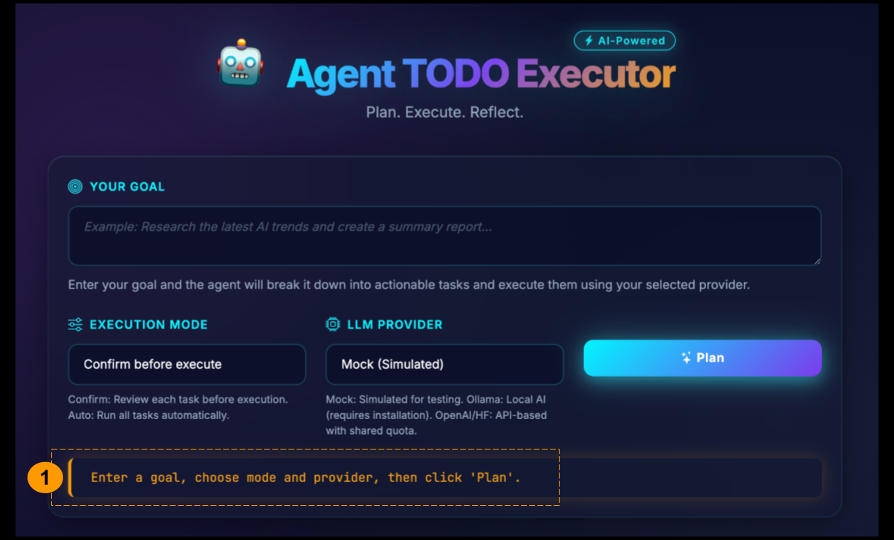
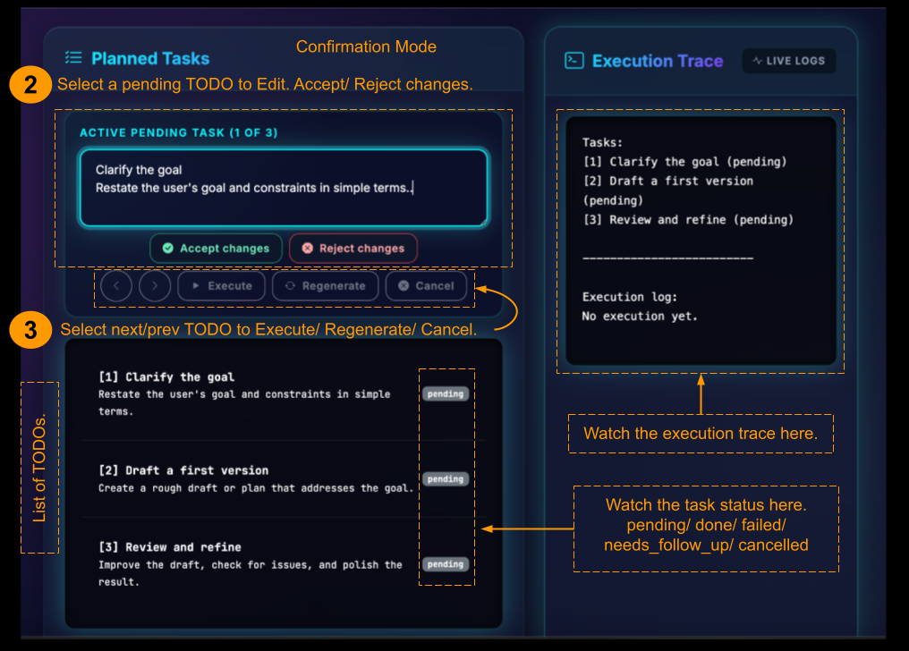

# Agent-Driven TODO Executor

A lightweight FastAPI application that turns a **high-level goal** into a structured TODO plan, then executes each step through an LLM-powered agent.
This project demonstrates a minimal “agent loop” — plan → execute → reflect → update with a clean UI and multiple LLM provider options, including a mock offline mode.

---

## 🌐 Live Demo Instances (Temporarily Hosted)

#### 🔗 https://agent-todo.fly.dev/ 
- Faster and stable, **Ollama NOT available**  

#### 🔗 http://13.60.227.208:8000/ (AWS - HTTP only)  
- Ollama **enabled** (CPU-only small model → slow + less capable)  
---

## Demo Screenshots




## ✨ Features

- Convert user goal → structured TODO plan  
- Two execution modes:
  - **Confirm Mode**: review tasks before execution  
  - **Auto Mode**: instantly plan + execute  
- Agent execution cycle:
  - Select next task  
  - Execute via LLM  
  - Reflect  
  - Update status  
- Transparent **Execution Trace**  
- Supports:
  - `mock` (offline)
  - `ollama`
  - `openai`
  - `hf`  
- Glassmorphic UI at `/static/index.html`

---

## 📁 Project Structure

```
agent-todo/
├── app/
│   ├── main.py           # FastAPI entrypoint + routes
│   ├── agent_core.py     # planning + execution agent logic
│   ├── llm_client.py     # unified wrapper for mock/ollama/openai/hf
│   ├── models.py         # Pydantic models
│
├── static/
│   ├── index.html        # UI (glassmorphism-style interface)
│   ├── app.js            # frontend logic
│
├── requirements.txt
├── .env                  # your environment variables (not committed)
│
├── deploy/
│   ├── Dockerfile
│   ├── fly.toml
│   ├── .dockerignore
```

---

## 🧪 Running Locally

### 1. Create & activate environment

```bash
python3 -m venv .venv
source .venv/bin/activate
```

### 2. Install dependencies

```bash
pip install -r requirements.txt
```

### 3. Create `.env`

```
LLM_PROVIDER=mock
OPENAI_API_KEY=your_key
HF_API_KEY=your_key
OLLAMA_MODEL=llama3.2
```

### 4. Start the server

```bash
uvicorn app.main:app --reload --port 8000
```

Open UI:

```
http://localhost:8000/static/index.html
```

---

## 🤖 LLM Providers

### Mock (default)

```
LLM_PROVIDER=mock
```

### Ollama

Install Ollama:

```bash
curl -fsSL https://ollama.com/install.sh | sh
ollama serve
ollama pull llama3.2
```

### OpenAI and Hugging Face

update the .env file with API keys.

---

## 🐳 Docker (Optional)

### Build

```bash
docker build -t agent-todo -f deploy/Dockerfile .
```

### Run

```bash
docker run -p 8000:8000 agent-todo
```

---

## ⚠️ Notes

- This is a minimal prototype, not production-grade.
- No agent frameworks (LangChain, LangGraph, AutoGPT, etc.) are used.
- Hosting will be available for a limited time only.
- OpenAI/HF calls are limited  
- Ollama is available as a CPU-only small model on (`http://13.60.227.208:8000/`) → slow  
- Ollama is not available on (`https://agent-todo.fly.dev/`) 

---

## 📄 License

MIT License
